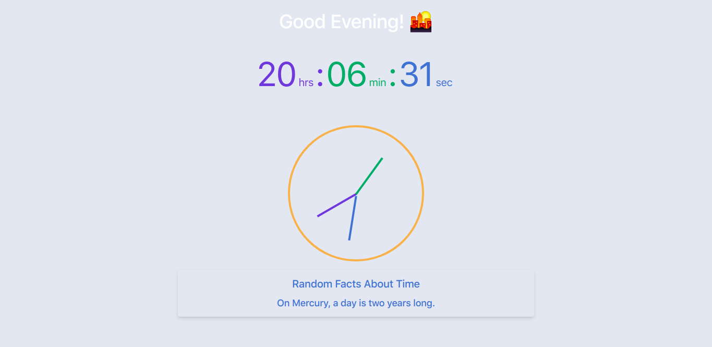

# JS Clock

## Live Version : [See here](https://sauravchamoli17.github.io/Clock/)

> A digital and analog representation of the clock where hours, minutes and second hand updates regularly according to the current time. It greets the user with respect to the current time. 
